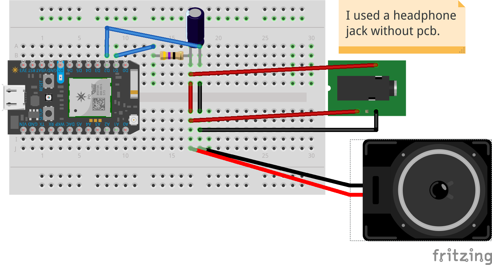

# photon-waveout

Audio playback library for the particle.io photon using two digital pins to
create an 8bit mono audio stream at 7874 Hz using AC PWM. This is not an
official Google product.

## how to use it

First you need to convert you audio sample into a c header. One way you can do
it is:

```Shell
gst-launch-1.0 -q uridecodebin uri=file:///path/to/audio-file ! audioconvert ! \
  audioresample ! audioconvert ! "audio/x-raw,format=S8,rate=7874,channels=1" ! \
  filesink location=/tmp/snd; \
  perl ~/bin/bin2hex.pl /tmp/snd 1 | sed -e 's/bin_data|wave_data/' >/tmp/wave_data.h
```

gstreamer is included with most linux distros and I found the bin2hex.pl at
http://www.chami.com/tips/delphi/052098D.html

## wiring



